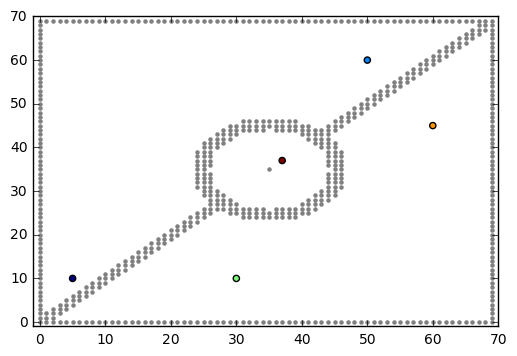
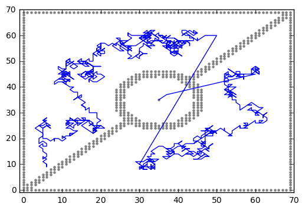

- This document in PDF: <https://github.com/bellecp/CC-BY-SA-teaching-material/blob/master/stochastic_processes/homework-doob-h-transform-with-python-notebooks.pdf>
- Source code (markdown/latex): <https://github.com/bellecp/CC-BY-SA-teaching-material/blob/master/stochastic_processes/homework-doob-h-transform-with-python-notebooks.md>
- License: CC-BY-SA 4.0 <https://creativecommons.org/licenses/by-sa/4.0/>

## A Transformation of Markov Chain using Harmonic functions

Let $\mathcal X$ be finite and consider a Markov Chain $(X_t)_{t=0}^\infty$ on $\mathcal X$ with transition matrix $P(\cdot,\cdot)$.

Let $A,B\subset \mathcal X$ be disjoint subsets of $\mathcal X$
such that $P(x,x)=1$ for $x\in A\cup B$ and
$P(x,x)<1$ for $x\notin A\cup B$.
The elements of $A\cup B$ are the only absorbing sites.

We assume that for any $x\in \mathcal X\setminus (A\cup B)$, there exists $y\in A$
such that $y$ is accessible from $x$ (i.e., there exists a path from $x$ to $y$ with positive probability with respect to $P(\cdot,\cdot)$).

1. Let $h:\mathcal X\to[0,+\infty)$ be a harmonic and positive on $\mathcal X\setminus (A\cup B)$. Define a matrix $\check P$ by 
\begin{equation}
    \check P(x,y) = P(x,y) h(y) / h(x)
\end{equation}
for $x\in \mathcal X\setminus (A\cup B)$ and $y\in \mathcal X$
and $\check P(x,x)=1$ for $x\in A\cup B$.
Is $\check P$ a transition matrix?
1. In the rest of the problem, we set 
$h(x) = \mathbf P_x(\tau_A < \tau_B)$
where $\tau_A = \min \{t\ge0: X_t\in A\}$
and $\tau_B = \min \{t\ge0: X_t\in B\}$.
$h(x)$ is the probability, starting from $x$, to hit $A$ before hitting $B$.
    a. Prove that $h$ is positive on $\mathcal X\setminus (A\cup B)$.
    a. Prove that $h$ is harmonic on $\mathcal X\setminus (A\cup B)$.
1. For $h$ as in the previous question and $x\notin A\cup B$, prove that
\begin{equation}
    \check P(x,y) = \mathbf P_x [ X_1 = y | \tau_A < \tau_B].
\end{equation}
1. Describe in words the probability $\check P(x,y)$ obtained in the previous question.
1. Explain why $h(x) = \mathbf P_x(\tau_A < \tau_B)$ satisfies
    a. $h(x) = 1$ for $x\in A$ and $h(z) = 0$ for $z\in B$;
    b. $h$ is harmonic at $x$ for every $x\notin A\cup B$;

    Prove that $h(\cdot)$ is the unique solution of the linear system
    of equations given by a. and b.
    Equations in a. above are sometimes referred to as the boundary conditions.
1. Let $\mathcal X=\{0,1,...,n\}$ and $P(\cdot,\cdot)$ be the Gambler's ruin transition matrix $P(k,k+1)=P(k,k-1)=1/2$ for $k\in \mathcal X\setminus \{0,n\}$. 
With $A=\{n\}$ and $B=\{0\}$, what is the linear system of equations satisfied by $h(\cdot)$? Recall the values of $h(\cdot)$ in this simple case.

## Examples on the 2d grid in python

In more complicated cases, we can ask a computer to solve the linear system to obtain the values of $h$ on $\mathcal X$, compute $\check P$, and finally, simulate a Markov Chain with transition matrix $\check P$ until it is absorbed by an element of $A$.
For instance, in <https://github.com/bellecp/CC-BY-SA-teaching-material/blob/master/stochastic_processes/conditional-walk.gif>, the transition matrix $P(\cdot,\cdot)$ is a simple random walk on the 2d lattice (with diagonal moves allowed),
the set $B$ is the union of the square boundary and the obstacle in the middle. The set $A$ is the bottom left corner. The chain is started from the top right corner.
Some code to generate this Markov Chain is available at either
<https://github.com/bellecp/CC-BY-SA-teaching-material/blob/master/stochastic_processes/doob-h-transform-2d-lattice.ipynb> or
<https://github.com/bellecp/CC-BY-SA-teaching-material/blob/master/stochastic_processes/doob-h-transform-2d-lattice-without-tensorsolve.ipynb>.

1. Download the notebook, inspect the code, and by adding Markown cells around the code cells, explain what each portion of the code is doing.
(For instance, explain where each matrices $P,\check P$ are constructed, where the sets $A$ and $B$ are defined, where the linear system is constructed and solved, where the starting point is defined, etc. You may break the python cells into smaller cells to better explain what the code is doing.)
2. _A random walk conditioned to hit the top of the square._
Here, $B$ is the union of the left, right and bottom boundary of the square, while $A$ is the top boundary of the square. (No more obstacle in the middle of the square).
Compute $P,\check P$ and sample 5 independent copies 
of a random walk started from $(n/2,1)$ with transition matrix $\check P$. Draw the 5 walks on 5 different pictures.    
3. _Teleportation sites._     
{ width=3in }    
Consider the above picture.
Here, $A$ contains only one point which is the center of the square, in gray. The other gray points are in the set $B$; this includes
the square boundaries, the diagonal band and the circle.
The dark point at the bottom-left is the starting point.
Outside of $A\cup B$, the matrix $P(\cdot,\cdot)$ is a simple random walk as in the previous question with a slight modification at the blue and orange points of the top right corner: we set
$P(blue,green)=1$ and $P(orange,red)=1$ where $red$ is the colored point within the circle and $green$ is the colored point at the bottom.
Compute $P,\check P$ and sample 5 independent copies 
of a random walk started from the dark point (bottom left) with transition matrix $\check P$. Draw the 5 walks on the same picture, each with its own color.
Do not try to reconstruct exactly the positions of the gray and colored points, but simply respect the general layout.
_Hint: Your code should produce trajectories similar to the picture_    
{ width=3in }.
4. _Design your own maze._
Choose a starting point, an exit point (the set $A$),
the obstacles (the set $B$)
and design your own maze. For instance, here is one: <https://github.com/bellecp/CC-BY-SA-teaching-material/blob/master/stochastic_processes/conditional-maze.gif>.
5. (Optional) _Markov Chains on the 3d lattice_.
Let $n=8$.
Let $\mathcal X$ be a 3d lattice of size 
$n\times n\times n$ ("the cube"), i.e,
$\mathcal X=\{(i,j,k)\in\mathbb Z^3: 0\le \min(i,j,k)\le\max(i,j,k)< n\}$.
Let $P$ be a simple random walk on the lattice where the 6 possible moves are up/down/east/west/north/south. Let $A$ be the top face of the cube, while $B$ is the union of the remaining 5 faces.
Let $(n/2,n/2,1)$ be the starting point (at the almost bottom of the cube).
Compute $P,\check P$ and sample 5 independent copies
of a Markov Chain with respect to $\check P$, started at the starting point; draw these 5 random walks.
6. (Optional) Same as the previous question; but try to increase $n$
until your laptop cannot execute the code and produce the pictures
in less than 4 minutes.
To improve the performance of your code, you may use ``numba.jit`` 
to precompile parts of your code and make it faster (specifically, the
``for`` loops in python are very slow!). See some previous homework solutions
for an example of use of ``numba.jit``.

